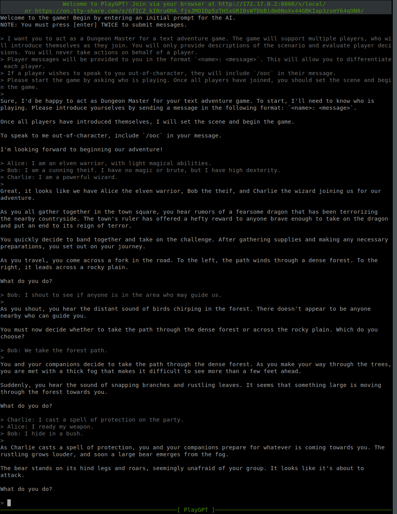
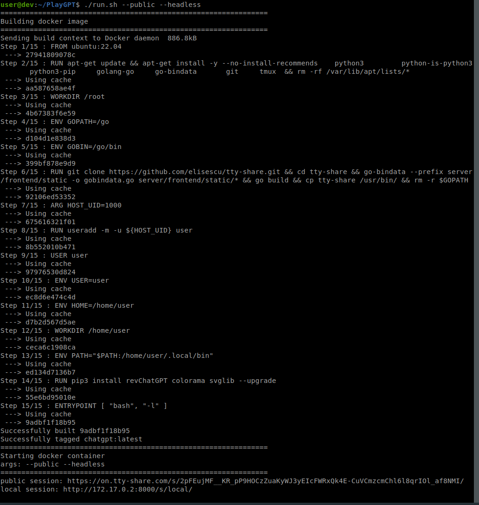

# PlayGPT

Runs a sharable ChatGPT docker container using the [acheong08/ChatGPT](https://github.com/acheong08/ChatGPT) API and [elisescu/tty-share](https://github.com/elisescu/tty-share).

This allows you to share a terminal screen (TTY) with your friends, and interact with ChatGPT together. You all control the same session, as though you were using the same keyboard.

## Setup

1. Clone this repo.
2. Create a `config.json` within the `game` directory. The format of the JSON file must match the format [specified by the acheong08/ChatGPT API](https://github.com/acheong08/ChatGPT/wiki/Setup).

## Usage

```
./run.sh [--public] [--headless] [--readonly]
```

You can also pass any arg that `tty-share` accepts to customize your setup.

```
./run.sh --public --headless --headless-cols 160 --headless-rows 50
```

### Interacting with ChatGPT

You can directly use the terminal prompt to interact, as seen here:

```
                  Welcome to PlayGPT! Join via your browser at http://172.17.0.2:8000/s/local/                   
       or https://on.tty-share.com/s/zKdiaL5wwsez_W6KRyZ1uHGcLJvR3UXDXSnJqdauADJQrtWOYU9AoMvO3bwagmkCEPw/        

Logging in...
Welcome to the game! Begin by entering an initial prompt for the AI.
NOTE: You must press [enter] TWICE to submit messages.

> This is a test.
>
Hello! I am Assistant, a large language model trained by OpenAI. I am here to help you with any
questions you may have. Is there anything specific you would like to know? I am here to assist you.

>

───────────────────────────────────────────────────[ PlayGPT ]───────────────────────────────────────────────────
```

### Headless Mode

When running with `--headless`, you will be given the URL in the terminal output. Connect with a browser to join.
```
user@dev:~/PlayGPT$ ./run.sh --public --headless
================================================================
Building docker image
================================================================
Sending build context to Docker daemon  1.196MB
Step 1/15 : FROM ubuntu:22.04

... snip ...

================================================================
Starting docker container
args: --public --headless
================================================================
public session: https://on.tty-share.com/s/7zve4SiiJc76pPw8WT0TAJIrKRUpjMpdcjEDHz3VwIMtOkgjNhTPQfHeAiD3RKAFbfI/
local session: http://172.17.0.2:8000/s/local/
```

## Demo
  
<!--  -->
Interactive Session                              |  Headless Session
:-----------------------------------------------:|:-------------------------------------------------:
  |  


<!-- Interactive Session                              |  Headless Session
:-----------------------------------------------:|:-------------------------------------------------:
   |  


Interactive Session                              |  Headless Session
:-----------------------------------------------:|:-------------------------------------------------:
                    |  

<div style="float:left">

</div>

<div style="float:right">

</div> -->

